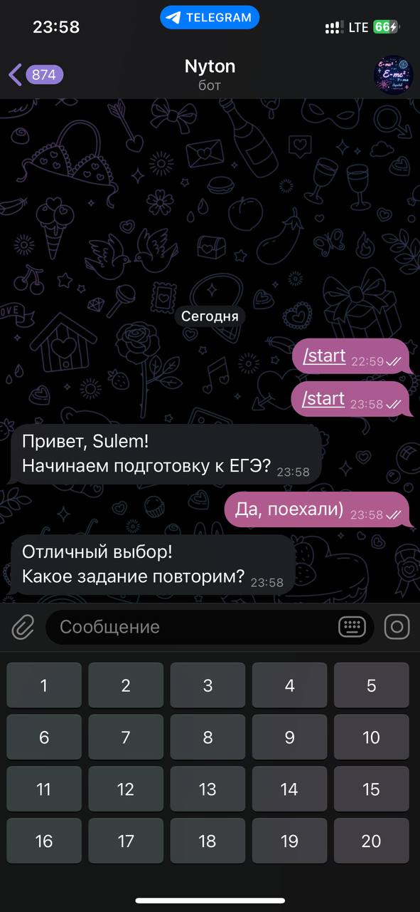
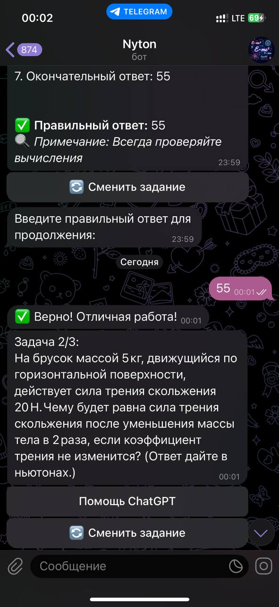

# 🚀 ЕГЭ Physics Bot: AI-репетитор для подготовки к экзамену

[](https://www.python.org)

[](https://docs.aiogram.dev)

[](https://www.docker.com)

[](https://openai.com)


## 🌟 Основные возможности

✅ **Автопроверка задач**

60+ актуальных заданий из ЕГЭ с мгновенной проверкой.

🧠 **AI-Объяснения**

Интеграция с GPT-4 для персонализированных объяснений ошибок.

📊 **Статистика прогресса**

Трекер успеваемости по всем темам с графиками.

📚 **Теоретические материалы**

PDF и DOCX файлы по 20 разделам физики.

## 🛠 Технологии

- **Backend**: Python 3.11, Aiogram 3.0

- **AI**: OpenAI API, Google Gemini

- **Инфраструктура**: Docker, Docker Compose

- **Аналитика**: Prometheus, Grafana

## 📦 Установка

### Локальный запуск

```bash

git clone https://github.com/yourusername/ege-physics-bot.git

cd ege-physics-bot

pip install -r requirements.txt

python bot.py

```

### Docker-версия

```bash

docker-compose up --build -d

```

## 📸 Скриншоты

|  |  |  |

## 📄 Документация и поддержка

Задавайте вопросы в [Telegram-чате](https://t.me/@sulem6g).

## 📜 Лицензия

Проект распространяется под лицензией MIT. Подробности в [LICENSE](LICENSE).

## 🤝 Как внести вклад

1. Форкните репозиторий

2. Создайте ветку: `git checkout -b feature/amazing-feature`

3. Зафиксируйте изменения: `git commit -m 'Add amazing feature'`

4. Запушьте ветку: `git push origin feature/amazing-feature`

5. Откройте Pull Request

## 🌟 Благодарности

Спасибо сообществу [OpenAI](https://openai.com) за мощные модели ИИ.

[](https://www.digitalocean.com)

---

**🚀 Попробуйте бота прямо сейчас:** [@EgePhysicsBot](https://t.me/NytonEGE_bot)

## 🚧 Планы развития
- [ ] Мобильное приложение
- [ ] Система рейтинга
- [ ] Интеграция с Zoom
- [ ] Геймификация обучения

```
